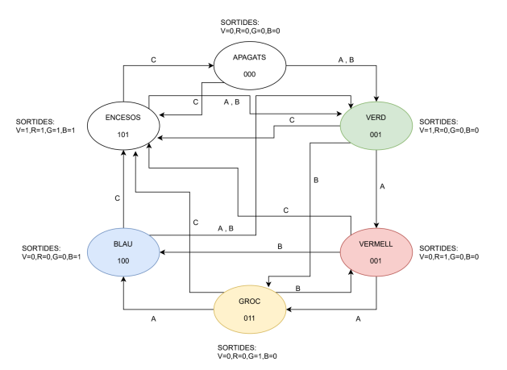
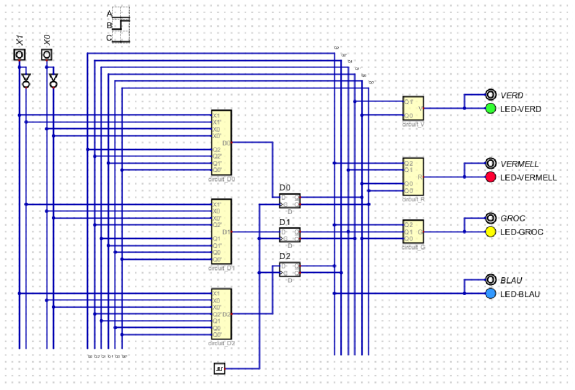
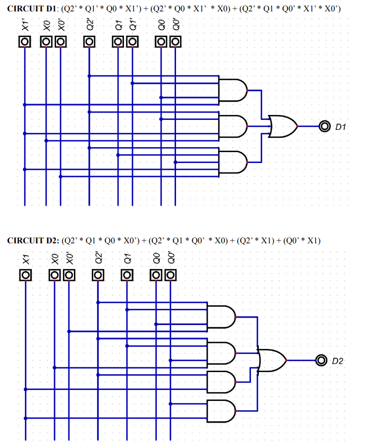
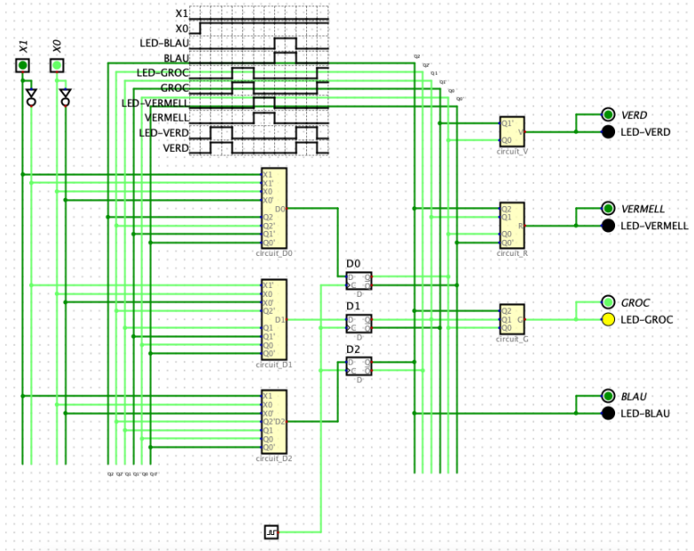

# Sistema secuencial de iluminación para árbol de Navidad

Proyecto final de **Sistemas Digitales** realizado con la herramienta **Digital**.  
El objetivo de la práctica es diseñar e implementar un **circuito secuencial** que controle la iluminación de un árbol de Navidad mediante una **máquina de Moore** y **flip-flops tipo D**.

## Descripción

El circuito controla cuatro grupos de luces:

- **VERD** (verde)
- **VERMELL** (rojo)
- **GROC** (amarillo)
- **BLAU** (azul)

La selección del comportamiento se realiza con dos entradas `x1 x0`:

| Modo | `x1 x0` | Comportamiento |
|---|---:|---|
| A | `00` | `verde -> rojo -> amarillo -> azul -> ...` |
| B | `01` | `verde -> amarillo -> rojo -> azul -> ...` |
| C | `10` | `todas encendidas -> todas apagadas -> ...` |

Además:

- Al cambiar de **C** a **A** o **B**, la secuencia debe empezar siempre en **verde**.
- Al cambiar de **A** o **B** a **C**, la secuencia debe empezar con **todas las luces encendidas**.

## Diseño del sistema

Para resolver el problema se planteó una **máquina de Moore**, donde las salidas dependen únicamente del estado actual.  
El sistema se construyó a partir de:

- **diagrama de transición de estados**
- **codificación de estados**
- **tabla de transición y de salidas**
- **minimización con mapas de Karnaugh de 5 variables**
- **implementación con flip-flops tipo D**
- **verificación mediante simulación**

### Estados codificados

| Estado | `Q2 Q1 Q0` |
|---|---:|
| APAGATS | `000` |
| VERD | `001` |
| VERMELL | `010` |
| GROC | `011` |
| BLAU | `100` |
| T. ENCESOS | `101` |

> En la memoria original se usa la notación `V = VERD`, `R = VERMELL`, `G = GROC` y `A = BLAU`.

## Funciones minimizadas

### Salidas

```text
VERD     = Q1' * Q0
VERMELL  = (Q2 * Q0) + (Q1 * Q0')
GROC     = (Q2 * Q0) + (Q1 * Q0)
BLAU     = Q2
```

### Entradas de los flip-flops D

```text
D2 = (Q2' * Q1 * Q0 * X0') + (Q2' * Q1 * Q0' * X0) + (Q2' * X1) + (Q0' * X1)

D1 = (Q2' * Q1' * Q0 * X1') + (Q2' * Q0 * X1' * X0) + (Q2' * Q1 * Q0' * X1' * X0')

D0 = (Q2 + Q0' + X1 + X0) * (Q2 + Q1' + X1 + X0') * (Q2' + Q0' + X1')
```

## Implementación en Digital

La solución final se desarrolló en **Digital**, separando parte de la lógica en subcircuitos y conectándolos dentro de una solución general.

### Estructura del proyecto

```text
CIRCUITS/
├── circuit_D0.dig
├── circuit_D1.dig
├── circuit_D2.dig
├── circuit_G.dig
├── circuit_R.dig
├── circuit_V.dig
└── solucio.dig
```

**Nota:** en el ZIP no aparece un subcircuito independiente para `BLAU`; según la memoria, esa salida se simplifica a `Q2`, por lo que puede estar integrada directamente en la solución general.

## Cómo abrir el proyecto

1. Abre la herramienta **Digital**.
2. Carga el archivo **`solucio.dig`** para ver el circuito completo.
3. Usa las entradas `x1` y `x0` para seleccionar el modo:
   - `00` -> modo A
   - `01` -> modo B
   - `10` -> modo C
4. Ejecuta la simulación con el reloj para observar la evolución de estados y el encendido de los LEDs.

## Capturas

### Diagrama de estados y codificación


### Circuito general en Digital


### Lógica de los flip-flops D


### Ejemplo de simulación y cronograma


## Qué demuestra este proyecto

Este trabajo reúne varios conceptos clave de sistemas digitales:

- diseño de **máquinas de estados**
- uso de **flip-flops tipo D**
- obtención de ecuaciones mediante **mapas de Karnaugh**
- implementación modular de lógica combinacional y secuencial
- validación del comportamiento con simulación temporal

## Autoría

Práctica realizada por:

- **Josep Gabriel Fornés Reynés**
- **Antoni Cruz Carrió**

---

Si vas a subir este proyecto a GitHub, este README está pensado para acompañar directamente el repositorio junto a los archivos `.dig` y la carpeta `assets/`.
